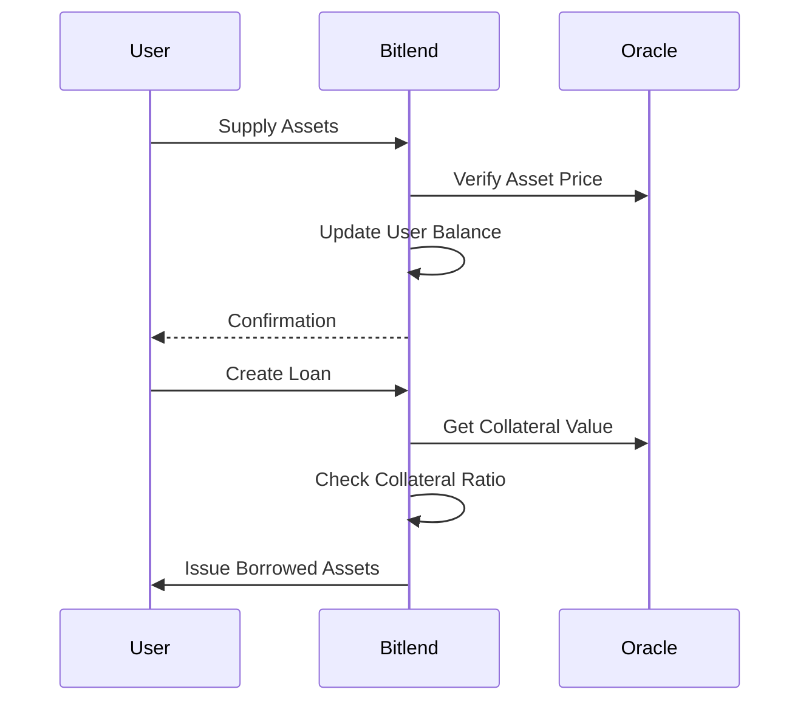

# Bitlend Protocol - Decentralized Lending on Bitcoin

Bitlend is a decentralized lending protocol natively built on Bitcoin through the Stacks Layer 2 solution. This protocol enables permissionless lending and borrowing of Bitcoin and other supported digital assets with sophisticated risk management mechanisms and transparent operations.

## Key Features

- **Native Bitcoin Integration**: Operates directly on Bitcoin's security through Stacks L2
- **Multi-Asset Support**: Borrow and lend various assets with oracle-based price feeds
- **Risk-Managed Lending**:
  - 125% Minimum Collateral Ratio
  - 110% Liquidation Threshold
  - 10% Liquidation Penalty
- **Dynamic Interest Rates**: Market-driven borrowing costs
- **Protocol Safety Mechanisms**:
  - Emergency pause functionality
  - Protocol-owned reserve fund (0.5% fee on borrows)
  - Decentralized liquidations
- **Transparent Accounting**:
  - Real-time supply/borrow tracking
  - Public loan health monitoring
  - Protocol fee transparency

## Core Functionality

### 1. Asset Management

**Supply Assets:**

```clarity
(supply-asset 'ST1PQHQKV0RJXZFY1DGX8MNSNYVE3VGZJSRTPGZGM.asset-token u500 'ST1PQHQKV0RJXZFY1DGX8MNSNYVE3VGZJSRTPGZGM.token-contract)
```

- Earn interest on deposited assets
- Assets contribute to protocol liquidity

**Withdraw Assets:**

```clarity
(withdraw-asset 'ST1PQHQKV0RJXZFY1DGX8MNSNYVE3VGZJSRTPGZGM.asset-token u200 'ST1PQHQKV0RJXZFY1DGX8MNSNYVE3VGZJSRTPGZGM.token-contract)
```

- Withdraw available liquidity
- Subject to protocol liquidity constraints

### 2. Borrowing System

**Create Loan:**

```clarity
(create-loan
  'ST1PQHQKV0RJXZFY1DGX8MNSNYVE3VGZJSRTPGZGM.collateral-token
  u1000
  'ST1PQHQKV0RJXZFY1DGX8MNSNYVE3VGZJSRTPGZGM.borrow-token
  u500
  'ST1PQHQKV0RJXZFY1DGX8MNSNYVE3VGZJSRTPGZGM.collateral-contract
  'ST1PQHQKV0RJXZFY1DGX8MNSNYVE3VGZJSRTPGZGM.borrow-contract)
```

- Over-collateralized borrowing
- Real-time collateral ratio monitoring
- Automatic interest accrual

**Loan Management:**

- Partial/full repayments
- Additional collateral top-ups
- Interest rate adjustments based on market conditions

### 3. Liquidation Engine

```clarity
(liquidate-loan u42
  'ST1PQHQKV0RJXZFY1DGX8MNSNYVE3VGZJSRTPGZGM.borrow-contract
  'ST1PQHQKV0RJXZFY1DGX8MNSNYVE3VGZJSRTPGZGM.collateral-contract)
```

- Public liquidation incentives
- 10% liquidation bonus for liquidators
- Automated bad debt resolution

## Key Parameters

| Parameter                | Value   | Description                             |
| ------------------------ | ------- | --------------------------------------- |
| Minimum Collateral Ratio | 125%    | Minimum collateralization for new loans |
| Liquidation Threshold    | 110%    | Collateral level triggering liquidation |
| Liquidation Penalty      | 10%     | Discount given to liquidators           |
| Protocol Fee             | 0.5%    | Fee on borrowed amount                  |
| Interest Rate Model      | Dynamic | Utilization-based rates (sample 5% APY) |

## Security Architecture

### Oracle Integration

- Decentralized price feeds
- Multiple oracle support
- Fallback to default oracle

```clarity
(define-trait oracle-trait
  ((get-price (string-ascii 42) (response uint uint)))
```

### Risk Management

- Over-collateralization requirements
- Real-time collateral ratio checks
- Circuit breaker pattern (emergency pause)

### Protocol Safeguards

```clarity
(define-constant MIN_COLLATERAL_RATIO u125)
(define-constant LIQUIDATION_THRESHOLD u110)
(define-constant LIQUIDATION_PENALTY u10)
(define-constant PROTOCOL_FEE u5)
```

## Developer Guide

### Contract Interactions

**Query Loan Health:**

```clarity
(calculate-collateral-ratio u42)
```

**Check Liquidation Status:**

```clarity
(is-loan-liquidatable u42)
```

**Get Protocol Stats:**

```clarity
(get-protocol-info)
```

### Flow Diagrams



## Admin Functions

### Protocol Management

```clarity
(set-protocol-paused true)  ;; Emergency pause
(add-supported-asset 'ST1N...token u0 'ST1N...oracle "get-price" u8)
```

### Fee Management

```clarity
(withdraw-protocol-fees 'ST1PQHQKV0RJXZFY1DGX8MNSNYVE3VGZJSRTPGZGM.token u500 'ST1PQHQKV0RJXZFY1DGX8MNSNYVE3VGZJSRTPGZGM.contract)
```

## Audit Considerations

1. **Oracle Security**
   - Price feed accuracy
   - Oracle failure handling
2. **Collateral Valuation**
   - Decimal handling
   - Cross-asset pricing
3. **Interest Calculation**

   - Block-based accrual
   - Compound interest model

4. **Liquidation Mechanics**
   - Incentive alignment
   - Partial liquidation support
